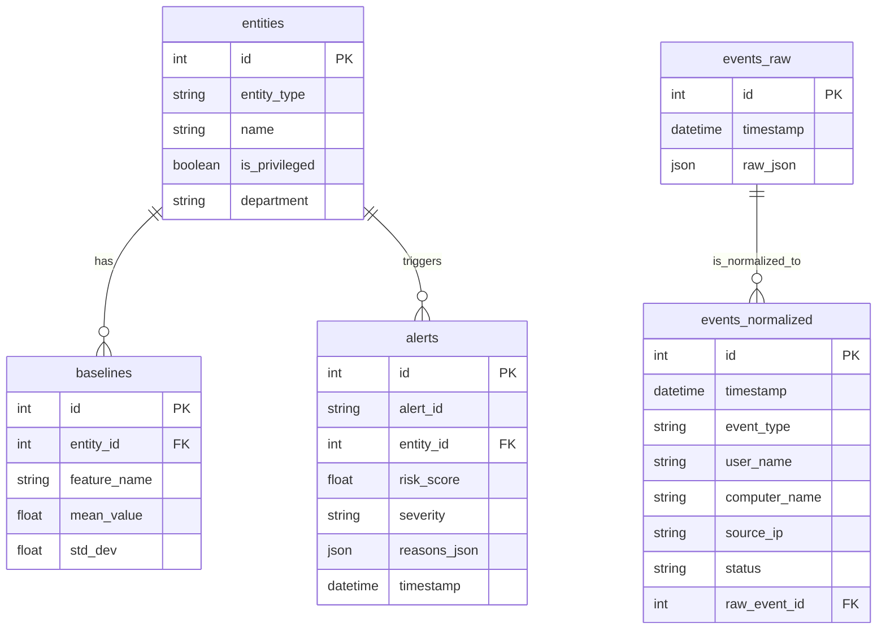

# Cyber-DNA Database Schema

## Entity-Relationship Diagram

## Data Dictionary

### 1. `events_raw`
Stores the original, unprocessed event logs.

| Column Name | Data Type | Constraints | Description |
| :--- | :--- | :--- | :--- |
| `id` | Integer | PK, Auto-increment | Unique identifier for the raw event. |
| `timestamp` | DateTime | Default: `now()` | When the event was received/logged. |
| `raw_json` | JSON | | The raw, unstructured event data. |

### 2. `events_normalized`
Stores parsed and standardized event data extracted from raw events.

| Column Name | Data Type | Constraints | Description |
| :--- | :--- | :--- | :--- |
| `id` | Integer | PK, Auto-increment | Unique identifier for the normalized event. |
| `timestamp` | DateTime | | When the actual event occurred. |
| `event_type` | String | Indexed | The categorized type of the event. |
| `user_name` | String | Indexed, Nullable | The user associated with the event. |
| `computer_name` | String | Indexed, Nullable | The machine associated with the event. |
| `source_ip` | String | Nullable | Source IP address of the event. |
| `status` | String | Nullable | Success/Failure status. |
| `raw_event_id` | Integer | FK (`events_raw.id`) | Reference back to the original raw event. |

### 3. `entities`
Stores information about entities (users, computers) being monitored.

| Column Name | Data Type | Constraints | Description |
| :--- | :--- | :--- | :--- |
| `id` | Integer | PK, Auto-increment | Unique identifier for the entity. |
| `entity_type` | String | | The type of entity (e.g., 'user', 'computer'). |
| `name` | String | Indexed, Unique | The unique name/identifier of the entity. |
| `is_privileged` | Boolean| Default: `False` | Whether the entity has elevated privileges. |
| `department` | String | Nullable | The department the entity belongs to. |

### 4. `baselines`
Stores behavioral baselines for entities to detect anomalies.

| Column Name | Data Type | Constraints | Description |
| :--- | :--- | :--- | :--- |
| `id` | Integer | PK, Auto-increment | Unique identifier for the baseline record. |
| `entity_id` | Integer | FK (`entities.id`) | Reference to the entity this baseline is for. |
| `feature_name`| String | | The metric or feature being baselined. |
| `mean_value` | Float | | The historical average value. |
| `std_dev` | Float | | The historical standard deviation. |

### 5. `alerts`
Stores security alerts generated by anomaly detection.

| Column Name | Data Type | Constraints | Description |
| :--- | :--- | :--- | :--- |
| `id` | Integer | PK, Auto-increment | Internal unique identifier for the alert. |
| `alert_id` | String | Indexed, Unique | Public-facing unique alert identifier. |
| `entity_id` | Integer | FK (`entities.id`) | The entity that triggered the alert. |
| `risk_score` | Float | | The calculated risk score. |
| `severity` | String | | Alert severity (e.g., Low, Medium, High). |
| `reasons_json`| JSON | | Detailed JSON explaining why the alert fired. |
| `timestamp` | DateTime | Default: `now()` | When the alert was generated. |
