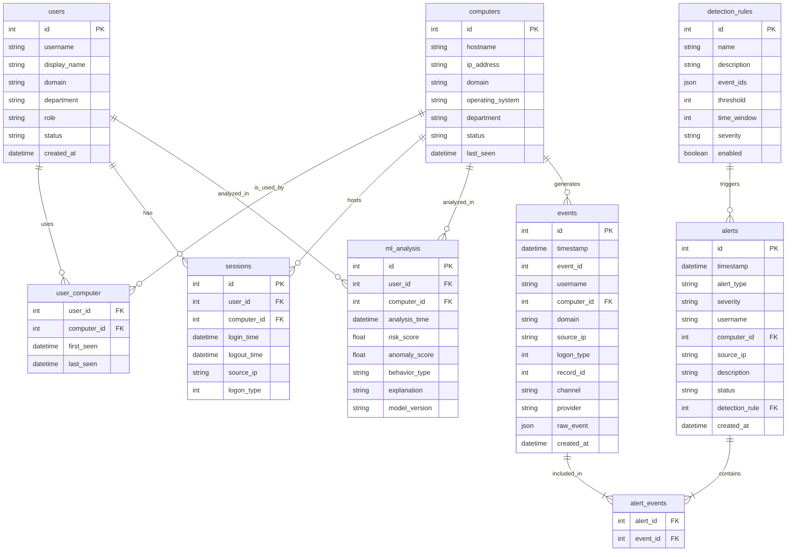

# Cyber-DNA Database Schema

## Entity-Relationship Diagram

```mermaid
erDiagram
    users ||--o{ user_computer : "uses"
    computers ||--o{ user_computer : "is_used_by"
    users ||--o{ sessions : "has"
    computers ||--o{ sessions : "hosts"
    users ||--o{ ml_analysis : "analyzed_in"
    computers ||--o{ ml_analysis : "analyzed_in"
    computers ||--o{ events : "generates"
    detection_rules ||--o{ alerts : "triggers"
    alerts ||--|{ alert_events : "contains"
    events ||--|{ alert_events : "included_in"

    users {
        int id PK
        string username
        string display_name
        string domain
        string department
        string role
        string status
        datetime created_at
    }

    computers {
        int id PK
        string hostname
        string ip_address
        string domain
        string operating_system
        string department
        string status
        datetime last_seen
    }

    events {
        int id PK
        datetime timestamp
        int event_id
        string username
        int computer_id FK
        string domain
        string source_ip
        int logon_type
        int record_id
        string channel
        string provider
        json raw_event
        datetime created_at
    }

    alerts {
        int id PK
        datetime timestamp
        string alert_type
        string severity
        string username
        int computer_id FK
        string source_ip
        string description
        string status
        int detection_rule FK
        datetime created_at
    }

    alert_events {
        int alert_id FK
        int event_id FK
    }

    detection_rules {
        int id PK
        string name
        string description
        json event_ids
        int threshold
        int time_window
        string severity
        boolean enabled
    }

    ml_analysis {
        int id PK
        int user_id FK
        int computer_id FK
        datetime analysis_time
        float risk_score
        float anomaly_score
        string behavior_type
        string explanation
        string model_version
    }

    user_computer {
        int user_id FK
        int computer_id FK
        datetime first_seen
        datetime last_seen
    }

    sessions {
        int id PK
        int user_id FK
        int computer_id FK
        datetime login_time
        datetime logout_time
        string source_ip
        int logon_type
    }
```

## Data Dictionary

### 1. `users`
Represents the people/accounts in the AD.
Columns: `id`, `username`, `display_name`, `domain`, `department`, `role`, `status`, `created_at`

### 2. `computers`
Represents the employee computers.
Columns: `id`, `hostname`, `ip_address`, `domain`, `operating_system`, `department`, `status`, `last_seen`

### 3. `events`
Stores the raw and normalized Windows security events collected from computers.
Columns: `id`, `timestamp`, `event_id`, `username`, `computer_id`, `domain`, `source_ip`, `logon_type`, `record_id`, `channel`, `provider`, `raw_event`, `created_at`

### 4. `alerts`
Security alerts generated by the system.
Columns: `id`, `timestamp`, `alert_type`, `severity`, `username`, `computer_id`, `source_ip`, `description`, `status`, `detection_rule`, `created_at`

### 5. `alert_events` (Association Table)
Maps multiple events to a single alert. For example, linking 5 failed logon events to a single Brute Force Alert.
Columns: `alert_id`, `event_id`

### 6. `detection_rules`
Stores the rule-based detection logic to organize what triggers alerts.
Columns: `id`, `name`, `description`, `event_ids`, `threshold`, `time_window`, `severity`, `enabled`

### 7. `ml_analysis`
Stores the results from Machine Learning anomaly detection algorithms.
Columns: `id`, `user_id`, `computer_id`, `analysis_time`, `risk_score`, `anomaly_score`, `behavior_type`, `explanation`, `model_version`

### 8. `user_computer` (Association Table)
Tracks which users normally use which computers for behavioral analysis.
Columns: `user_id`, `computer_id`, `first_seen`, `last_seen`

### 9. `sessions`
Tracks active user sessions on specific computers.
Columns: `id`, `user_id`, `computer_id`, `login_time`, `logout_time`, `source_ip`, `logon_type`
