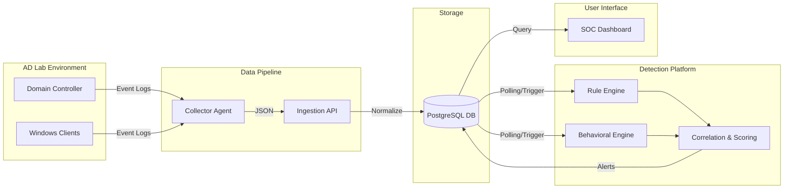
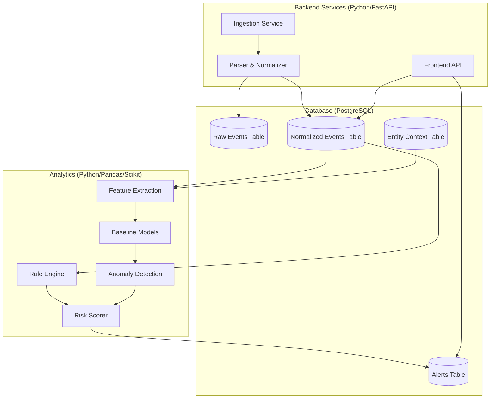
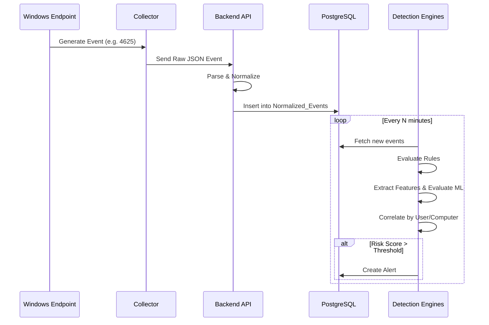
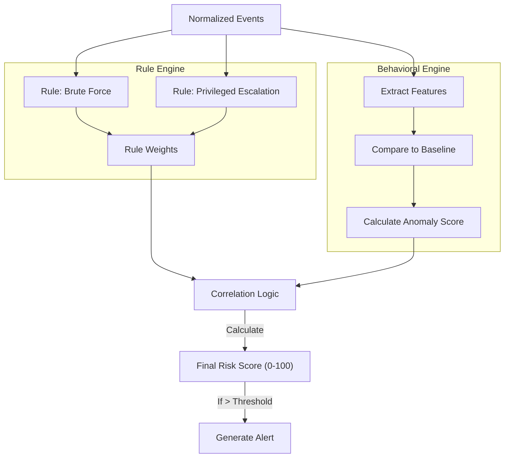
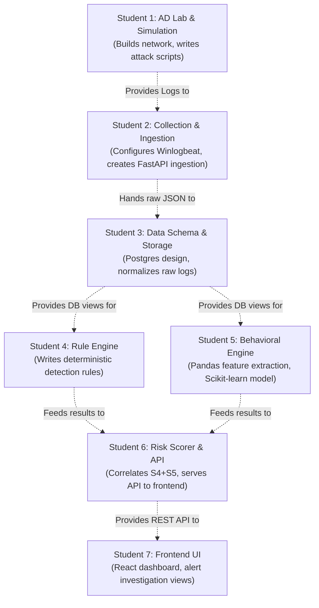
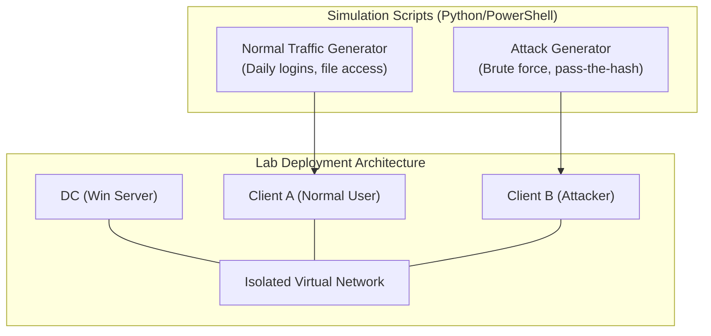

# Final Architecture: Intelligent Behavioral Analytics and Threat Detection Platform

## 1. Architecture Verdict

This revised architecture radically simplifies the data collection and storage layers while emphasizing the detection logic and evaluation framework. Network telemetry, automated response, and big data clusters have been entirely removed from the MVP. The focus is now exclusively on analyzing Windows Event Logs and Active Directory context to answer the core research question: comparing rule-based vs. behavioral detection.

## 2. Design Principles

*   **Academic Focus:** The system exists to prove a thesis, not to sell as a product. The pipeline must facilitate metrics generation (Precision, Recall, F1-score).
*   **Modularity:** The architecture must cleanly separate collection, processing, detection, and presentation so 7 students can work in parallel without blocking each other.
*   **Minimalist Plumbing:** We will use established, simple tools for data transport and storage to save time for analytics.
*   **Explainability:** Black-box ML models are rejected. Every risk score and alert must have a traceable, human-readable justification.

## 3. Final Recommended Architecture

The platform operates as a straightforward pipeline:
1.  **Collection:** Lightweight agents (e.g., Winlogbeat) forward specific Windows Event Logs to a central API.
2.  **Processing & Storage:** A Python backend validates, normalizes, and stores the events in a relational database (PostgreSQL).
3.  **Detection (Asynchronous):** Two engines (Rules and Behavioral) independently evaluate new data and generate local anomaly/suspicion scores.
4.  **Correlation & Scoring:** A correlation engine combines these scores based on the entity (User/Computer) to generate a final Risk Score and trigger an alert if necessary.
5.  **Presentation:** A web frontend displays the alerts and entity timelines.

## 4. High-Level Architecture Diagram



## 5. Detailed Component Architecture



## 6. Data Flow Diagram



## 7. Detection & Analytics Architecture

The core of the research lies here. 

*   **Rule Engine (Deterministic):** Evaluates events against static signatures (e.g., Event ID 4720 Account Created). Outputs a boolean match and a static severity weight.
*   **Behavioral Engine (Probabilistic):**
    *   **Feature Extraction:** Aggregates events over time (e.g., "failed logins in last hour", "distinct computers accessed today").
    *   **Algorithm:** **Isolation Forest** or **Statistical Z-Score**. These are lightweight, explainable unsupervised anomaly detection methods perfect for students. Do not use Deep Learning.
    *   **Output:** An Anomaly Score (e.g., 0.0 to 1.0).



## 8. Storage Architecture

**Recommendation:** **PostgreSQL**.
Do not use Elasticsearch, Splunk, or Hadoop. PostgreSQL is perfectly capable of handling millions of rows (which is plenty for a lab environment), supports JSONB for raw log retention, and is universally understood by software students.

*   `events_raw`: `id`, `timestamp`, `raw_json`
*   `events_normalized`: `id`, `timestamp`, `event_type`, `user`, `computer`, `source_ip`, `status`
*   `entities`: `id`, `type (user/computer)`, `is_privileged`, `department`
*   `baselines`: `entity_id`, `feature_name`, `mean`, `std_dev`
*   `alerts`: `id`, `entity_id`, `risk_score`, `reasons_json`, `timestamp`

## 9. Alert & Investigation Architecture

Alerts must be highly explainable to support the academic thesis. An alert in the database should be generated via a JSON payload like this:

```json
{
  "alert_id": "ALT-1042",
  "entity": "john.doe",
  "entity_type": "user",
  "timestamp": "2024-05-12T03:15:00Z",
  "risk_score": 85,
  "severity": "HIGH",
  "detection_summary": {
    "rules_triggered": ["Multiple Failed Logins", "Success after failure"],
    "anomalies_detected": [
      {"feature": "login_hour", "value": 3, "expected_range": "8-18", "z_score": 3.4}
    ]
  },
  "related_event_ids": [10405, 10406, 10407, 10408],
  "recommendation": "Verify if user is traveling or working off-hours. Check IP origin."
}
```

## 10. Technology Stack

*   **Infrastructure:** Windows Server (Domain Controller), Windows 10/11 (Clients) running in VirtualBox/Proxmox.
*   **Collector:** **Winlogbeat** (Elastic). It reads Windows Event Logs natively and can send standard JSON to an HTTP endpoint (Logstash output plugin configured to hit our custom API). Extremely easy to configure.
*   **Backend/API:** **Python + FastAPI**. Fast, typed, modern, and perfectly suited for moving data into the database and serving the frontend.
*   **Database:** **PostgreSQL**. Relational, robust, simple.
*   **Analytics:** **Python + Pandas + Scikit-Learn**. The academic standard. Easy to calculate statistics (Pandas) and run Isolation Forests (Scikit-Learn).
*   **Frontend:** **React + TypeScript (Vite)**. Standard, fast to build UI dashboards.

## 11. MVP Scope

*   **Lab:** 1 DC, 2 Clients, a script to simulate regular activity and attack activity.
*   **Events:** Only process core security logs (e.g., 4624, 4625, 4672, 4720).
*   **Pipeline:** Winlogbeat -> FastAPI -> Postgres.
*   **Detection:** 3-5 hardcoded Rules. 1 ML model (Isolation Forest) based on time-of-day and frequency features.
*   **UI:** 1 Dashboard showing Alerts, 1 Page showing User Timeline.
*   **Evaluation:** A script to calculate Precision, Recall, and False Positive Rate based on known simulated attacks.

## 12. Future Extensions (Out of Scope for MVP)

*   Network packet capture (Zeek/Suricata).
*   Automated Active Directory remediation (disabling accounts).
*   Deep Learning (LSTMs, Autoencoders).
*   Integration with external Threat Intelligence feeds.
*   Distributed microservices architecture (Kafka, Kubernetes).

## 13. 7-Student Responsibility Mapping

To ensure parallel development, the team is divided into distinct, non-blocking workstreams:



## 14. Development Phases

*   **Phase 1 (Week 1-2):** AD Lab built. Background noise generation script running.
*   **Phase 2 (Week 3):** Winlogbeat installed. Logs successfully landing in PostgreSQL via FastAPI.
*   **Phase 3 (Week 4):** Database schema finalized. Normalizer extracting key fields.
*   **Phase 4 (Week 5-6):** Basic Rule Engine active. Simple React frontend displaying raw normalized logs.
*   **Phase 5 (Week 7-8):** Feature extraction running. Baseline established on background noise.
*   **Phase 6 (Week 9-10):** Behavioral anomaly detection active. Risk Scoring engine merging Rules + ML.
*   **Phase 7 (Week 11):** Launch simulated attacks in Lab. Tune thresholds.
*   **Phase 8 (Week 12):** Academic Evaluation (Calculating Precision/Recall). Polish UI.

## 15. Testing & Evaluation Strategy

The most critical part of an academic project is the evaluation. You must have a controlled lab to generate a labeled dataset (knowing exactly when an attack occurred).


**Evaluation Metrics:**
Because the team knows *exactly* when the `Attack Generator` ran, they can label the ground truth. Compare the platform's alerts against the ground truth to calculate: True Positives, False Positives, False Negatives, Precision, Recall, and F1-Score. Compare these metrics for "Rules Only", "ML Only", and "Combined".

## 16. Security Considerations

Even in a lab, demonstrate security best practices:
*   **Auth:** The React frontend should require a simple JWT login.
*   **Transport:** Winlogbeat should send data to FastAPI over HTTPS (self-signed cert is fine for a lab).
*   **Secrets:** Database credentials must be stored in `.env` files, never hardcoded in git.
*   **Least Privilege:** The database user the Python app uses should only have INSERT/SELECT rights, not schema modification rights.

## 17. Architecture Risks and Mitigations

*   **Risk 1 (Over-engineering ML):** Students often jump straight to Neural Networks. **Mitigation:** Strictly mandate statistical methods or Isolation Forests first. Only try advanced ML if Phase 9 is reached early.
*   **Risk 2 (Data Starvation):** ML needs data to baseline. If the lab is turned off every day, baselines will fail. **Mitigation:** The background noise script (Student 1) is the most important component. It must run 24/7 to generate weeks of fake historical data.
*   **Risk 3 (Polling Bottleneck):** Having the detection engine poll the database every second is inefficient. **Mitigation:** For an MVP, polling every 1-5 minutes is perfectly acceptable. Do not introduce Kafka/RabbitMQ just to solve this in a lab environment.

## 18. Final Recommended Project Scope

This architecture delivers a highly focused, research-oriented platform. It strips away commercial SIEM bloat and relies on standard, understandable software engineering patterns. By separating the rule engine from the behavioral engine and culminating in an explainable risk scorer, the team of 7 will have distinct responsibilities and a clear path to answering their thesis question with mathematical rigor.
